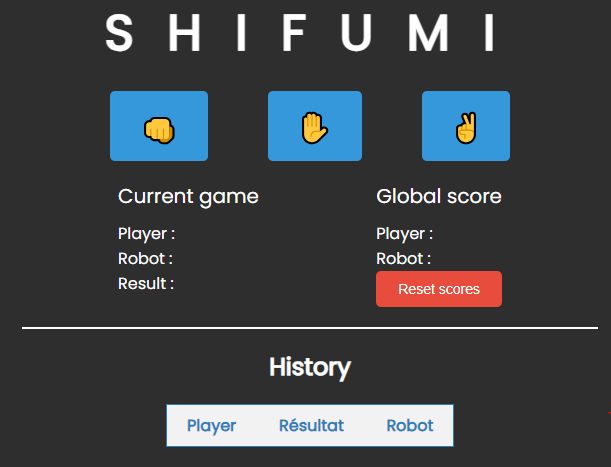

# Shifumi - Rock, Paper, Scissors

  

## About

Shifumi is a simple web application of the Rock, Paper, Scissors game with a fun twist. Choose from traditional options and discover the outcomes. Plus, there's a secret element, "The Well," that can be unlocked after consecutive losses!

## How to Play

- Click on emojis to choose your move:
  - 👊 for Rock
  - ✋ for Paper
  - ✌ for Scissors
- Try to beat the robot by selecting a move that will defeat it.
- Keep an eye on the overall score to see who's winning.

## Features

- User-friendly interface with fun emojis.
- Tracking of the global score for players and the robot.
- Game history with clear results.
- Ability to unlock "The Well" after multiple consecutive losses.

## How to Run the Game

1. Clone this GitHub repository to your local machine.
2. Open the `index.html` file in your preferred web browser.

## Screenshots

  

---

Created with ❤️ by [FI$$](https://github.com/YourGitHubUsername)
